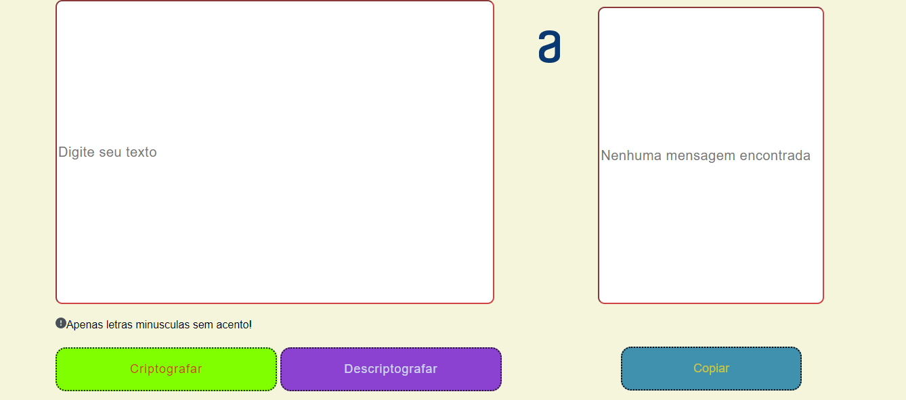
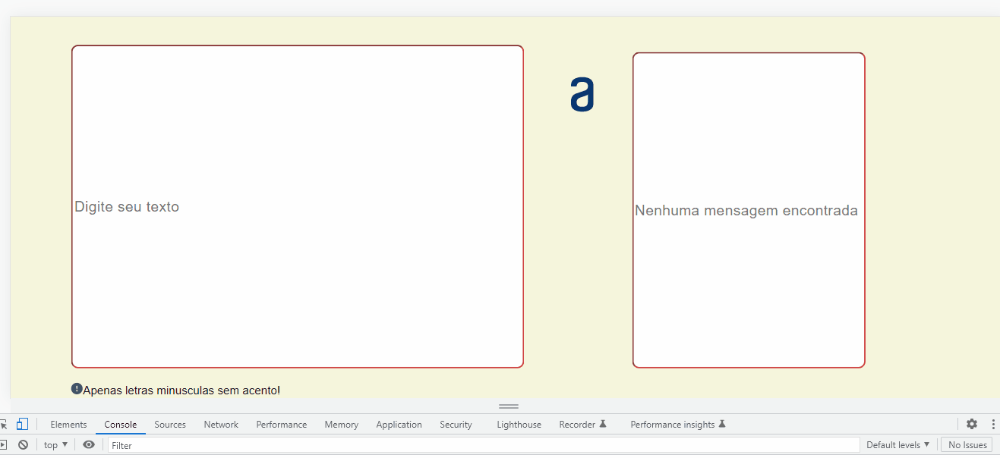

# Challenge codificador alura

## Sobre   
_O projeto consiste em coletar um dado do tipo texto em um input e gerando ele codificado no output. Além disso, foi adicionada a função de copiar e descodificar o texto digitado 
anteriormente._  

_O projeto está responsivo para todos os tipos de tela_

---

## Tecnologias Usadas

* HTML
* Css
* JavaScript
  
---

## Gif do projeto

